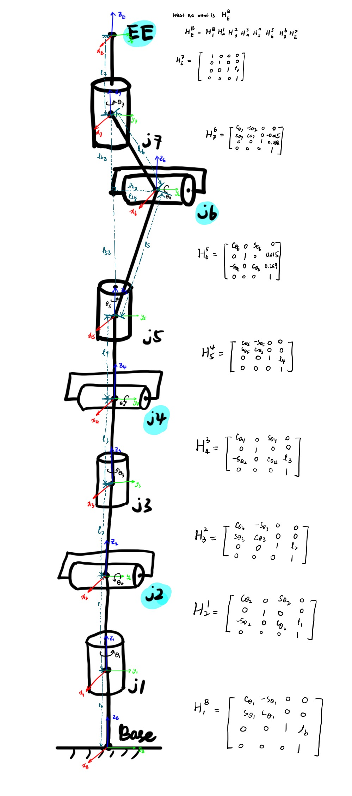
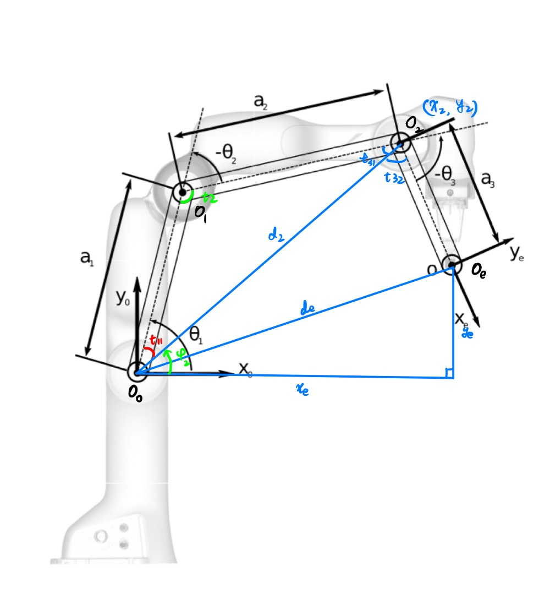
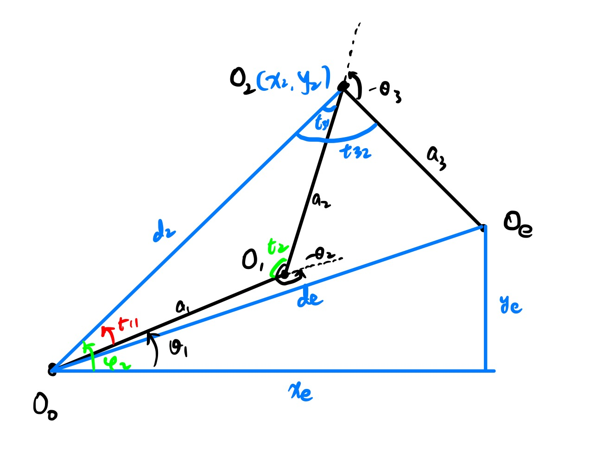
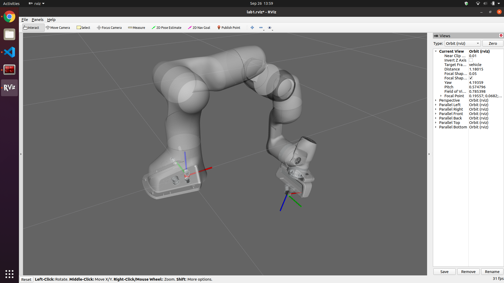
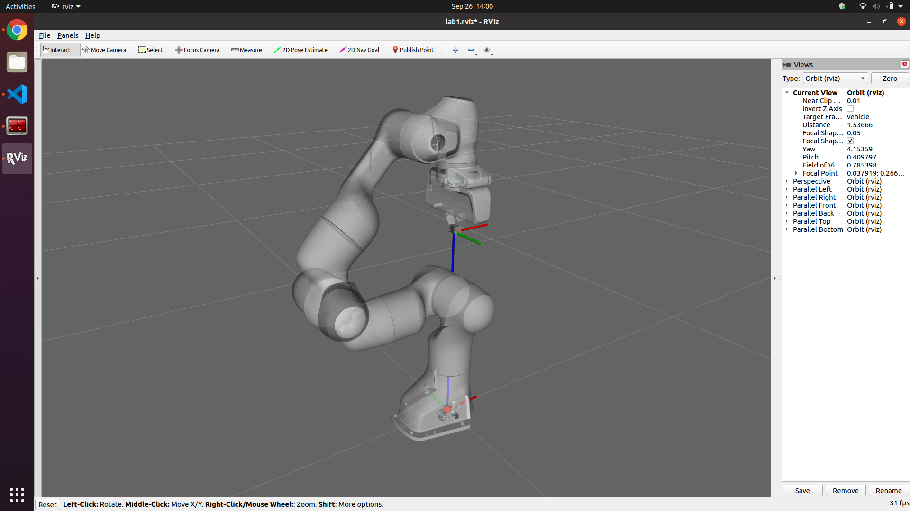
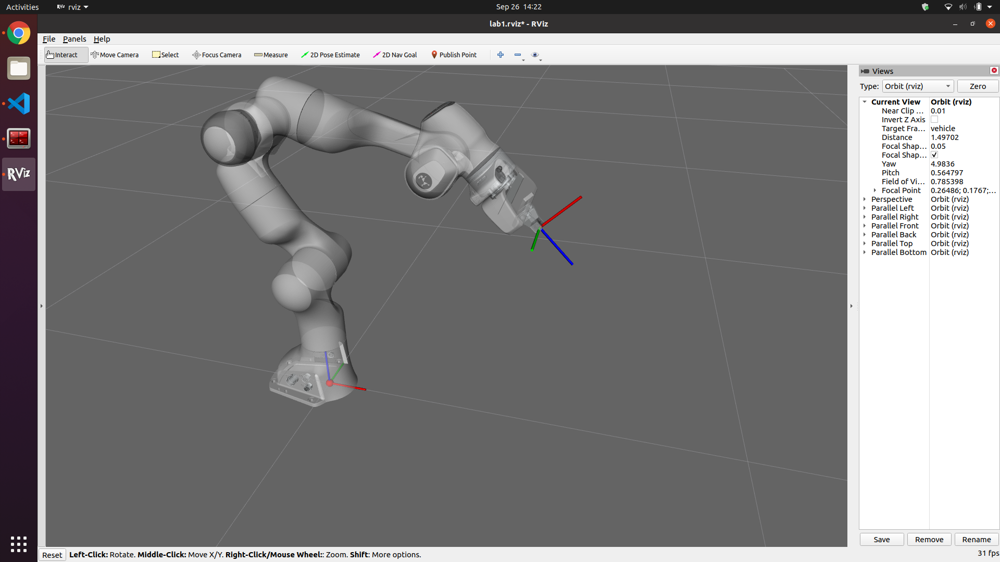
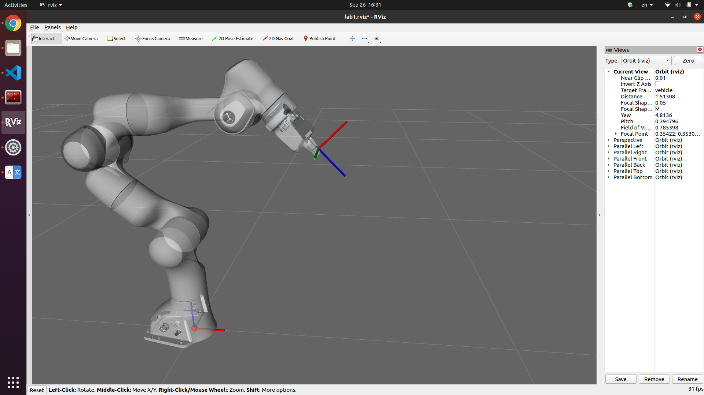

<script type="text/javascript" src="http://cdn.mathjax.org/mathjax/latest/MathJax.js?config=TeX-AMS-MML_HTMLorMML"></script>
<script type="text/x-mathjax-config">
    MathJax.Hub.Config({ tex2jax: {inlineMath: [['$', '$']]}, messageStyle: "none" });
</script>
# Lab 1 Report

## Methods

### Formulation

(TODO)



### FK

(TODO)

### IK

Use geometric approach:

* Draw the schematic of 2 solutions and define intermediate angles and edges as follow:

    
    

* Compute position of $O_2 (x_2, y_2)$
* Compute $d_2, d_e, \phi_2$
* Compute all the needed angles using law of cosine with known $a_1, a_2, a_3, d_2, d_e$
* Compute $\theta_1, \theta_2, \theta_3$ with the intermediate angles

## Evaluation

### FK

(TODO)

### IK

#### Target 1
```python
{ # IK target 1
    'o': np.array([0.5, -0.3]),
    'theta': pi/2+0.3
}
```


#### Target 2
```python
{ # IK target 2
    'o': np.array([0, 0.5]),
    'theta': pi/2
}
```


#### Target 3
```python
{ # IK target 3
    'o': np.array([0.5, 0.5]),
    theta': 1/4 * pi
}
```


## Analysis

### Gravity

#### FK
(TODO)

#### IK

With gravity, the manipulator tends to move faster and will have a little shake when reaching the target. The final posiiton of the end effector might be a little below the target.



The reason might be with gravity, the joints cannot reach the exact computed values because of the external gravity force.

### Reachable workspace

(TODO)

### Extending Inverse Kinematics to 3D

Panda does have a spherical wrist. However, kinematic decoupling does not work on the full Panda robot because it has 7 dofs, and you have to solve the first 4 joint variables with only 3 equations (the position of the wrist center). The appropriate way I can think of is to use geometric approach to solve the first 4 joint variables, and then the 3 joint variables of the wrist can be solved using Euler angles. 