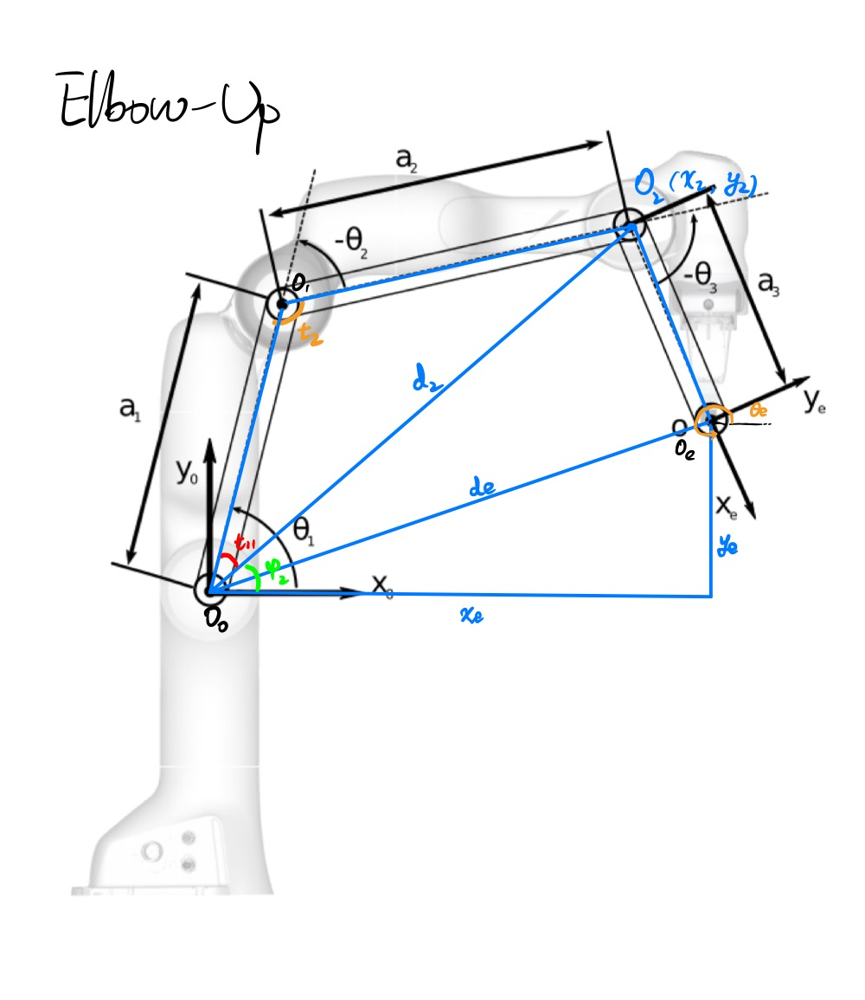
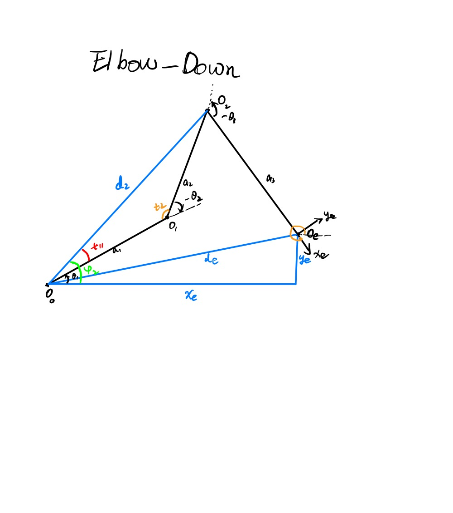
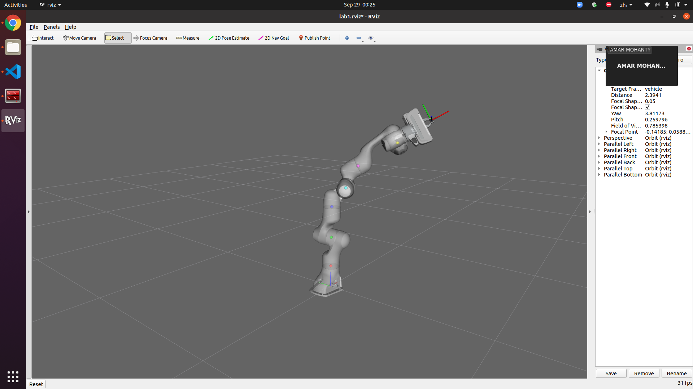
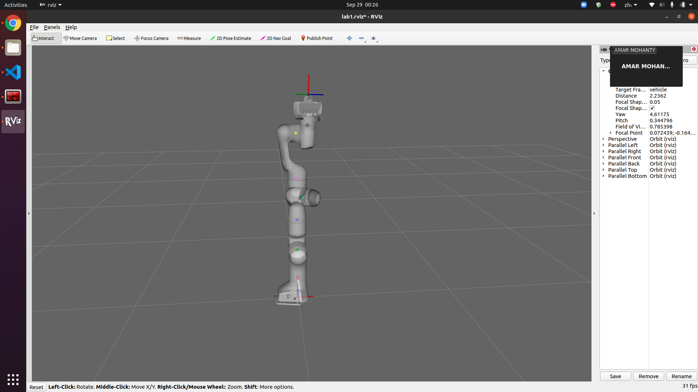
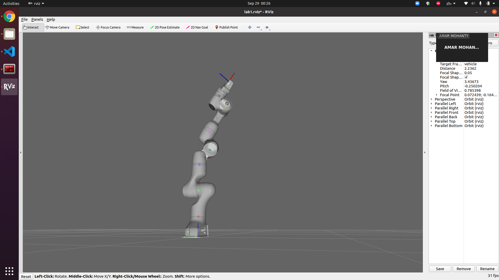

<script type="text/javascript" src="http://cdn.mathjax.org/mathjax/latest/MathJax.js?config=TeX-AMS-MML_HTMLorMML"></script>
<script type="text/x-mathjax-config">
    MathJax.Hub.Config({ tex2jax: {inlineMath: [['$', '$']]}, messageStyle: "none" });
</script>
# Lab 1 Report

## Methods

### Formulation

(TODO)

### FK

(TODO)

### IK

* Compute position of $O_2 (x_2, y_2)$
* Compute $d_2, d_e, \phi_2$
* Draw the elbow-up and elbow-down solutions
  * Compute intermediate angles $t_{11}, t_2$ using law of cosines
  * Compute $\theta_1, \theta_2$ for each solution using the intermediate $\phi_2, t_{11}, t_2$:

    
    

* Compute $\theta_3 = \theta_e - \theta_1 - \theta_2$

## Evaluation

### FK

If the joint points and end effector frame are glued to the robot as it moves, then the FK solution is correct

#### Config 1
`np.array([ 0,    0, -pi/3, -pi/3,  pi/3, pi,   pi/3 ])`

    
#### Config 2
`np.array([ 0,    0, pi/3, pi/3,  pi/3, pi,   pi/3 ])`

    
#### Config 3
`np.array([ 0,    0, -pi/3, -pi/6,  0, pi,   pi/3 ])`


### IK

If the end effector can reach the target with desired position and orientation, then the IK solution is correct. 

#### Target 1
```python
{ # IK target 1
    'o': np.array([0.5, -0.3]),
    'theta': pi/2+0.3
}
```


#### Target 2
```python
{ # IK target 2
    'o': np.array([0, 0.5]),
    'theta': pi/2
}
```


#### Target 3
```python
{ # IK target 3
    'o': np.array([0.5, 0.5]),
    theta': 1/4 * pi
}
```


## Analysis

### Gravity

With gravity, the manipulator tends to move faster and will have a little shake when reaching the target. The final posiiton of the end effector might be a little below the target.


The reason might be with gravity, the joints cannot reach the exact computed values because of the external gravity force.

### Reachable workspace

(TODO)

### Extending Inverse Kinematics to 3D

Panda does have a spherical wrist. However, kinematic decoupling does not work on the full Panda robot because it has 7 dofs, and you have to solve the first 4 joint variables with only 3 equations (the position of the wrist center). The appropriate way I can think of is to use geometric approach to solve the first 4 joint variables, and then the 3 joint variables of the wrist can be solved using Euler angles. The challenge with the 7 dof arm is that both numerical and geometric approach will be more complicated because of the one more redundant dof, and methods like kinematic decoupling will be inapplicable.